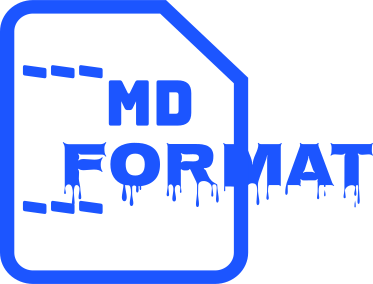

<div align="center">

# 

> CommonMark compliant Markdown formatter

</div>

```{include} ../README.md
:start-after: <!-- start mini-description -->
:end-before: <!-- end mini-description -->
```

The features/opinions of the formatter include:

- Consistent indentation and whitespace across the board
- Always use ATX style headings
- Move all link references to the bottom of the document (sorted by label)
- Reformat indented code blocks as fenced code blocks
- Use `1.` as the ordered list marker if possible, also for noninitial list items

Mdformat will not change word wrapping by default.
The rationale for this is to support [Semantic Line Breaks](https://sembr.org/).

For a comprehensive description and rationalization of the style,
read [the style guide](users/style.md).

```{include} ../README.md
:start-after: <!-- start faq -->
:end-before: <!-- end faq -->
```

```{toctree}
---
caption: For users
hidden: true
---
users/installation_and_usage.md
users/configuration_file.md
users/plugins.md
users/style.md
users/changelog.md
```

```{toctree}
---
caption: For contributors
hidden: true
---
contributors/contributing.md
```

```{toctree}
---
caption: External links
hidden: true
---
GitHub repository <https://github.com/executablebooks/mdformat>
PyPI page <https://pypi.org/project/mdformat/>
```
